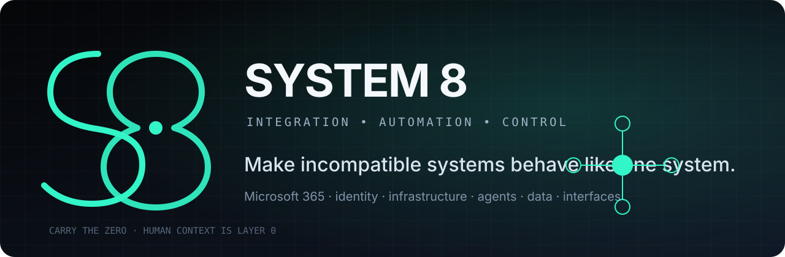

<div align="center">



<br />

[](tools/s8)
[](#system-8-package-manager)
[](LICENSE)
[](#current-surface)

**Make incompatible systems behave like one system.**

[Install](#one-line-install) · [Capabilities](#integration-surface) · [Tools](#current-surface) · [Architecture](docs/INTEGRATION-MODEL.md) · [Contributing](CONTRIBUTING.md)

</div>

---

## System 8

System 8 is an integration and automation practice focused on the joins between systems: identity, Microsoft 365, endpoints, infrastructure, applications, agents, data and the humans operating them.

The work is not limited to a vendor stack or interface. The operating problem is treated as one system, then reduced to explicit contracts, observable state and recoverable execution.

```text
people  →  interfaces  →  applications  →  automation  →  platforms  →  infrastructure
  L0           L8              L7               L6             L5–3             L2–1
```

**Layer 0 is human context.** A technically correct system that people cannot operate, trust or recover is incomplete.

## Integration surface

| Domain | Typical work |
|---|---|
| **Microsoft 365** | SharePoint, Teams, Purview, Entra ID, Power Platform, Graph, licensing and governance |
| **Identity and access** | Authentication, authorization, lifecycle, conditional access and cross-system identity mapping |
| **Infrastructure** | Windows, networking, TLS, DNS, endpoints, policy, deployment and operational diagnostics |
| **Automation** | PowerShell, APIs, browser automation, scheduled workflows, agents and event-driven orchestration |
| **Data and middleware** | Schema translation, adapters, migration, synchronization, audit trails and compatibility layers |
| **Interfaces** | Web, desktop, mobile, voice, DTMF, kiosk, dashboard and operator tooling |
| **Operational control** | Validation, dry runs, snapshots, rollback, observability and deterministic recovery |

## System 8 Package Manager

The repository includes a PowerShell 5.1/7-compatible package manager for System 8 tools.

### One-line install

```powershell
irm https://raw.githubusercontent.com/enkayz/system8/main/tools/s8/install.ps1 | iex
```

The bootstrap self-elevates, installs `s8`, adds it to the machine `PATH`, and installs the ADMX Manager by default.

```powershell
s8 list
s8 search admx
s8 install admx
s8 update admx
s8 doctor
s8 rollback admx
s8 remove admx
```

Install the package manager without installing ADMX Manager:

```powershell
& ([scriptblock]::Create((irm https://raw.githubusercontent.com/enkayz/system8/main/tools/s8/install.ps1))) -NoAdmx
```

## Current surface

### `s8` package manager

A common bootstrap and lifecycle layer for System 8 utilities.

- PowerShell 5.1 and 7 runtime support
- UAC self-elevation
- machine-level command registration
- stable, preview and nightly channel model
- package installation state
- update, diagnostics, removal and rollback

Source: [`tools/s8`](tools/s8)

### ADMX Repository Manager

Windows-native administrative-template repository manager designed for local `PolicyDefinitions` stores and Active Directory Central Stores.

- package import and staging
- ADMX/ADML XML validation
- SHA-256 inventory
- deployment dry runs
- pre-deployment snapshots
- transactional store replacement
- rollback and failure recovery

Source: [`tools/admx-manager`](tools/admx-manager)

## Operating model

System 8 integrations are built around five invariants:

1. **Contract first** — every boundary has an explicit input, output, ownership and failure mode.
2. **Observable state** — operators can determine what happened without reverse-engineering the implementation.
3. **Reversible change** — deployment includes validation, snapshot and rollback paths.
4. **Minimum coupling** — adapters isolate vendor and platform assumptions.
5. **Layer 0 included** — workflows are designed around the actual operator, not an imaginary perfect user.

The full model is documented in [`docs/INTEGRATION-MODEL.md`](docs/INTEGRATION-MODEL.md).

## Repository map

```text
.
├── assets/brand/          System 8 visual assets
├── docs/                  architecture and operating model
├── tools/
│   ├── s8/                System 8 package manager
│   └── admx-manager/      ADMX repository and rollback tooling
├── src/                   existing application source
├── convex/                existing Convex backend source
└── public/                static application assets
```

## Engineering standard

A System 8 tool should provide, where applicable:

- unattended and interactive execution paths
- PowerShell 5.1 and 7 compatibility for Windows administration tooling
- idempotent operations
- structured logs
- explicit exit conditions
- preflight diagnostics
- dry-run support
- checksums or signatures for downloaded artifacts
- transaction boundaries
- rollback or compensating actions
- documentation that reflects the actual implementation

## Security

Do not report vulnerabilities through public issues. See [`SECURITY.md`](SECURITY.md).

## Contributing

Small, independently verifiable changes are preferred. See [`CONTRIBUTING.md`](CONTRIBUTING.md).

---

<div align="center">

**Carry the zero.**

`System 8 · Perth, Western Australia`

</div>
